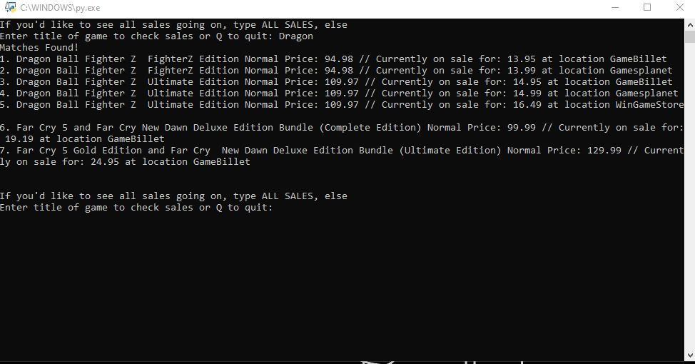
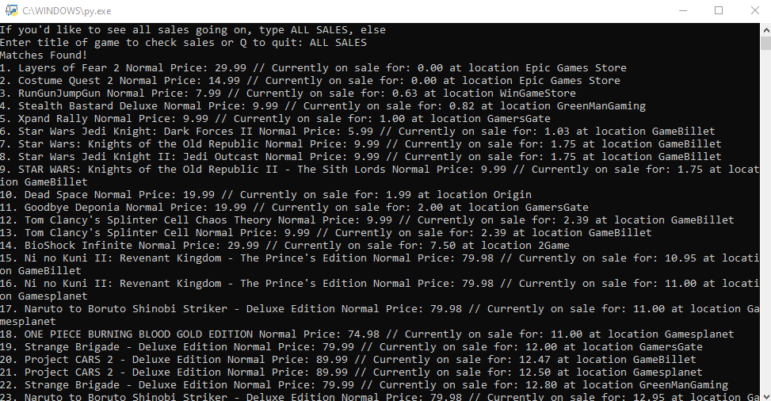
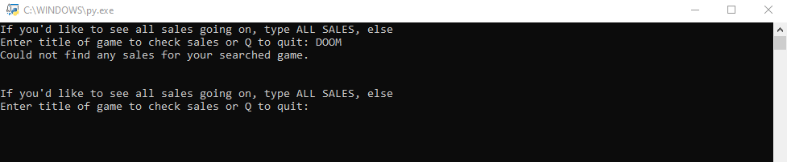

Special thanks to CheapShark for allowing free use of their API for this project.

I created this project so that I could quickly check every day if DOOM:Eternal was put on sale on Steam so that I could purchase it. I wanted something that I could quickly and easily navigate and access when I turned my computer on, so I chose to create this program.

To use the program, simply launch launchFile.py and enter a keyword of the game you're searching for. The program will utilize the CheapShark API to
detect if any games similar to your keyword are on sale on different digital platforms, and return up to 60 results.

Alternatively, you can enter ALL GAMES as your input to get a full breakdown of 60 games that are on sale and are being tracked by the API.

Some example of the program being used are located in the images below

